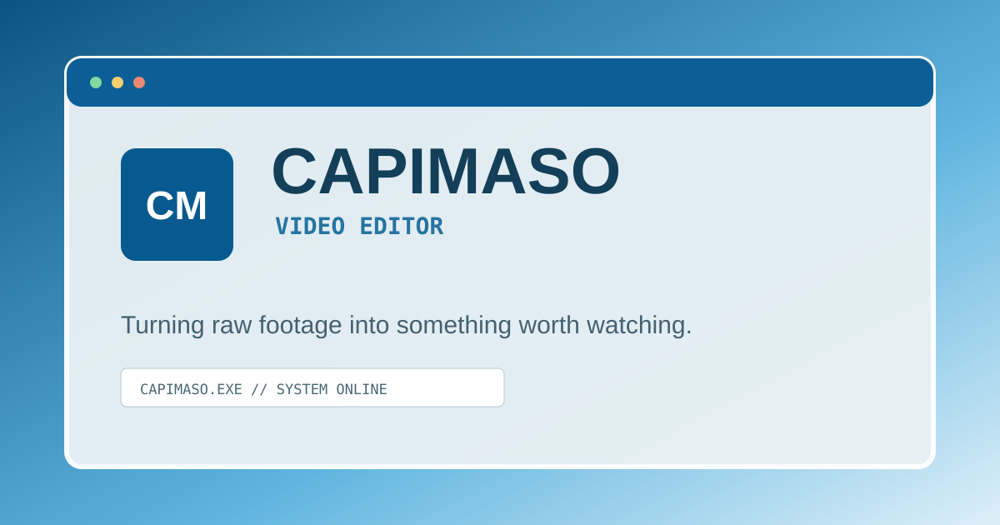

<div align="center">



<br>

# 🖥️ CAPIMASO

### VIDEO EDITOR PORTFOLIO

<code>CAPIMASO.EXE</code> · <code>SYSTEM ONLINE</code> · <code>READY</code>

<br>

<a href="https://nextjs.org/">
  
</a>
<a href="https://react.dev/">
  
</a>
<a href="https://www.typescriptlang.org/">
  
</a>
<a href="https://tailwindcss.com/">
  
</a>
<a href="https://motion.dev/">
  
</a>

<br><br>

> **The computer isn't just the interface. It is the portfolio.**

</div>

---

<table>
<tr>
<td width="55%">

## 💾 ABOUT

**CAPIMASO** is an interactive portfolio created for a video editor.

Instead of presenting the usual landing page, cards and sections, the entire portfolio is built around the idea of an old personal computer.

The visitor boots the system, reaches the desktop and explores the portfolio by opening programs, files and windows.

The result is a mix of:

* 🖥️ Windows XP aesthetics
* 💿 Y2K computer interfaces
* 🌐 early internet culture
* 🎬 video editing
* 🎮 gaming culture
* 📼 old media software
* 🧩 small digital imperfections

</td>

<td width="45%" align="center">

### SYSTEM STATUS

```text
╔══════════════════════╗
║   CAPIMASO SYSTEM    ║
╠══════════════════════╣
║ STATUS   : ONLINE    ║
║ MODE     : PORTFOLIO ║
║ USER     : VISITOR   ║
║ ACCESS   : GRANTED   ║
╚══════════════════════╝
```

🟢 **AVAILABLE FOR WORK**

</td>
</tr>
</table>

---

## 🗂️ FEATURES

<table>
<tr>
<td>🖱️ <b>Interactive Desktop</b></td>
<td>Desktop-based navigation with icons, windows and taskbar.</td>
</tr>
<tr>
<td>🪟 <b>Window Manager</b></td>
<td>Open, close, minimize, maximize, drag and focus windows.</td>
</tr>
<tr>
<td>▶️ <b>Video Player</b></td>
<td>Custom player interface for portfolio projects.</td>
</tr>
<tr>
<td>📁 <b>File Explorer</b></td>
<td>Projects and portfolio sections presented as files and folders.</td>
</tr>
<tr>
<td>🟦 <b>Start Menu</b></td>
<td>Central navigation inspired by classic desktop operating systems.</td>
</tr>
<tr>
<td>🖥️ <b>Boot Sequence</b></td>
<td>Short startup animation before entering the desktop.</td>
</tr>
<tr>
<td>📋 <b>Context Menu</b></td>
<td>Right-click interaction with desktop actions.</td>
</tr>
<tr>
<td>🔔 <b>Notifications</b></td>
<td>Small system-style notifications for user actions.</td>
</tr>
<tr>
<td>📱 <b>Responsive</b></td>
<td>Adapted experience for mobile devices.</td>
</tr>
<tr>
<td>♿ <b>Accessibility</b></td>
<td>Keyboard navigation, visible focus and semantic controls.</td>
</tr>
</table>

---

## 🎬 PORTFOLIO

The portfolio is organized as if the visitor were browsing a personal computer:

```text
C:\CAPIMASO\

├── PORTFOLIO
├── WORK
│   ├── 01_GAMING_EDIT.mp4
│   ├── 02_SHORT_FORM.mp4
│   ├── 03_LONG_FORM.mp4
│   ├── 04_MOTION_GRAPHICS.mp4
│   └── 05_CREATOR_CONTENT.mp4
│
├── ABOUT
├── SKILLS
├── SERVICES
└── CONTACT
```

Projects, services, contacts and profile information are separated from the UI so the content can be changed without rewriting the components.

---

## ⚙️ TECH STACK

<div align="center">

| Technology        | Purpose                        |
| :---------------- | :----------------------------- |
| **Next.js**       | Application framework          |
| **React**         | UI architecture                |
| **TypeScript**    | Type-safe development          |
| **Tailwind CSS**  | Styling                        |
| **Framer Motion** | Animations & microinteractions |
| **SVG / CSS**     | Local visual assets            |
| **Vercel**        | Deployment                     |

</div>

---

<details>
<summary>📂 Project Structure</summary>

<br>

```text
capimaso-portfolio/
│
├── app/
│   ├── layout.tsx
│   └── page.tsx
│
├── components/
│   ├── Desktop.tsx
│   ├── Window.tsx
│   ├── WindowContents.tsx
│   ├── Taskbar.tsx
│   ├── StartMenu.tsx
│   ├── Notifications.tsx
│   └── XPIcon.tsx
│
├── data/
│   ├── profile.ts
│   ├── projects.ts
│   ├── services.ts
│   ├── skills.ts
│   └── socials.ts
│
├── lib/
│   └── types.ts
│
├── public/
│   ├── images/
│   ├── icons/
│   ├── videos/
│   └── sounds/
│
├── styles/
│   └── globals.css
│
├── next.config.ts
├── package.json
└── README.md
```

</details>

---

## 🚀 RUN LOCALLY

### Requirements

* Node.js 20.9+
* npm

### Installation

```bash
npm install
```

### Development

```bash
npm run dev
```

Then open:

```text
http://localhost:3000
```

### Production Build

```bash
npm run build
npm start
```

---

## ✏️ CUSTOMIZATION

Most portfolio content can be changed from the `data/` directory.

<table>
<tr>
<th>File</th>
<th>What to edit</th>
</tr>
<tr>
<td><code>data/profile.ts</code></td>
<td>Name, profession, description and SEO information.</td>
</tr>
<tr>
<td><code>data/projects.ts</code></td>
<td>Projects, thumbnails, categories and video URLs.</td>
</tr>
<tr>
<td><code>data/services.ts</code></td>
<td>Services and package information.</td>
</tr>
<tr>
<td><code>data/skills.ts</code></td>
<td>Software and editing tools.</td>
</tr>
<tr>
<td><code>data/socials.ts</code></td>
<td>Email and social links.</td>
</tr>
</table>

### 🎥 Adding videos

Place your video files inside:

```text
public/videos/
```

Then reference them from:

```text
data/projects.ts
```

### 🖼️ Adding images

Place thumbnails and other images inside:

```text
public/images/
```

---

## ☁️ DEPLOY

The project is prepared for deployment with **Vercel**.

Typical workflow:

```text
LOCAL PROJECT
      │
      ▼
    GITHUB
      │
      ▼
    VERCEL
      │
      ▼
  CAPIMASO ONLINE
```

Push the repository to GitHub, import it into Vercel and deploy using the default Next.js configuration.

---

## 🧠 DESIGN PHILOSOPHY

This project intentionally avoids the usual portfolio formula.

There is no generic:

```text
[ Hero ]
[ About ]
[ Cards ]
[ Services ]
[ Contact ]
```

Instead:

```text
            ┌───────────────────────┐
            │     CAPIMASO.EXE      │
            ├───────────────────────┤
            │                       │
            │       DESKTOP         │
            │                       │
            │   📁    🎬    💻       │
            │                       │
            └───────────────────────┘
                     │
                     ▼
               EXPLORE THE
                PORTFOLIO
```

The interface itself communicates the personality of the editor.

---

## 📼 CURRENT STATE

```text
BOOT .............. OK
DESKTOP ........... OK
WINDOW SYSTEM ..... OK
TASKBAR ........... OK
START MENU ........ OK
VIDEO PLAYER ...... OK
RESPONSIVE ........ OK
SEO ............... OK

SYSTEM STATUS: ONLINE
```

---

<div align="center">

### 🖥️ CAPIMASO.EXE

**Video Editor Portfolio**

<sub>Built with code, video editing and an unreasonable amount of nostalgia.</sub>

<br><br>

`© CAPIMASO`

</div>
