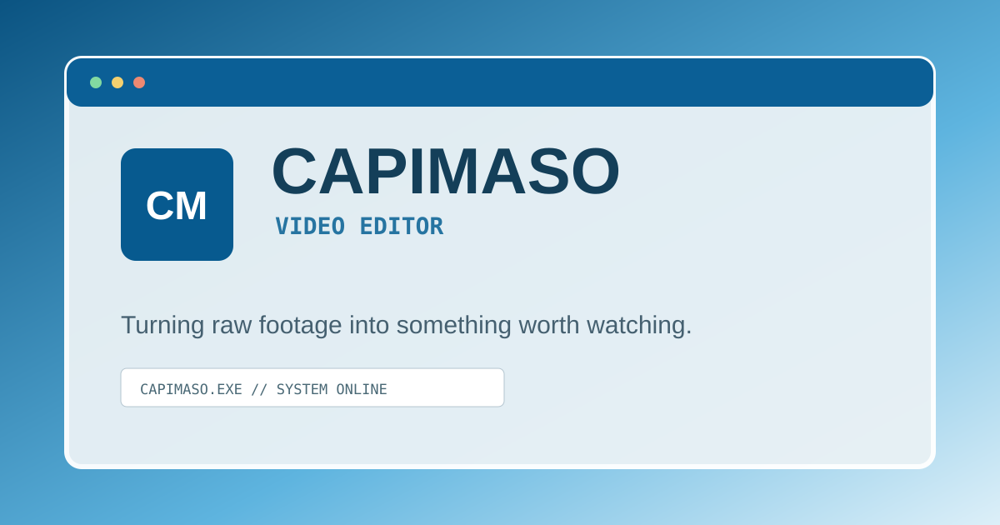

<div align="center">



# 🖥️ CAPIMASO

### VIDEO EDITOR PORTFOLIO

<code>CAPIMASO.EXE</code> · <code>SYSTEM ONLINE</code> · <code>READY</code>

<br><br>

<a href="https://nextjs.org/"></a>
<a href="https://react.dev/"></a>
<a href="https://www.typescriptlang.org/"></a>
<a href="https://tailwindcss.com/"></a>
<a href="https://motion.dev/"></a>

<br><br>

> **The computer isn't just the interface. It is the portfolio.**

</div>

---

<table>
<tr>
<td width="55%">

## 💾 ABOUT

An interactive video editor portfolio disguised as a nostalgic 2000s computer.

Boot the system, explore the desktop, open programs, browse files, watch projects and find the contact area — all inside one interface.

The visual language mixes **Windows-era UI ideas, Y2K computing, early internet culture, gaming and video editing** while keeping the implementation modern underneath.

</td>
<td width="45%" align="center">

### SYSTEM STATUS

```text
╔══════════════════════╗
║   CAPIMASO SYSTEM    ║
╠══════════════════════╣
║ STATUS   : ONLINE    ║
║ MODE     : PORTFOLIO ║
║ USER     : VISITOR   ║
║ ACCESS   : GRANTED   ║
╚══════════════════════╝
```

🟢 **AVAILABLE FOR WORK**

</td>
</tr>
</table>

---

## 🗂️ FEATURES

| Feature | What it does |
|:--|:--|
| 🖥️ Interactive Desktop | Desktop-based portfolio navigation |
| 🪟 Window Manager | Open, close, minimize, maximize, focus and drag windows |
| ▶️ Video Player | Local video playback with project metadata |
| 🖼️ Thumbnails Tab | `My Work` has a THUMBNAILS tab that shows every image in `public/images/thumbs/` automatically |
| 🔍 Image Viewer | Click a thumbnail to open it larger in its own window, with just the image |
| 📝 Guestbook | Orkut-style comments with photo, name and a clickable profile link, below `My Portfolio` |
| 📁 File Explorer | Portfolio sections presented as folders/files |
| 🟦 Start Menu | Central navigation inspired by classic desktop systems |
| 🔌 Boot Sequence | Short startup animation with skip control |
| 📋 Context Menu | Right-click actions such as View, Refresh and Properties |
| 🔔 Notifications | Small system-style feedback messages |
| 📱 Responsive | Adapted layout for phones and touch devices |
| ♿ Accessibility | Semantic controls, keyboard focus and reduced-motion support |

---

## 🎬 PORTFOLIO STRUCTURE

```text
C:\CAPIMASO\
│
├── PORTFOLIO
├── WORK
│   ├── 01_GAMING_EDIT.mp4
│   ├── 02_SHORT_FORM.mp4
│   ├── 03_LONG_FORM.mp4
│   ├── 04_MOTION_GRAPHICS.mp4
│   ├── 05_CREATOR_CONTENT.mp4
│   └── THUMBNAILS (every image in public/images/thumbs/)
│
├── ABOUT
├── SKILLS
├── SERVICES
└── CONTACT
```

The computer metaphor is the navigation. The actual portfolio data stays separate from the visual components.

---

## ⚙️ TECH STACK

- **Next.js 16** — application framework
- **React 19** — UI
- **TypeScript** — type safety
- **Tailwind CSS 4** — styling foundation
- **Framer Motion** — transitions and microinteractions
- **SVG / CSS** — local interface assets
- **Vercel** — deployment

---

<details>
<summary>📂 Project Structure</summary>

<br>

```text
capimaso-portfolio/
│
├── app/
│   ├── layout.tsx
│   └── page.tsx
│
├── components/
│   ├── Desktop.tsx
│   ├── Window.tsx
│   ├── WindowContents.tsx
│   ├── Taskbar.tsx
│   ├── StartMenu.tsx
│   ├── Notifications.tsx
│   └── XPIcon.tsx
│
├── data/
│   ├── profile.ts
│   ├── projects.ts
│   ├── services.ts
│   ├── skills.ts
│   ├── socials.ts
│   ├── media.ts
│   └── comments.ts
│
├── lib/
│   ├── types.ts
│   ├── i18n.tsx
│   └── thumbnails.ts
│
├── public/
│   ├── images/
│   │   ├── thumbs/      ← drop thumbnails here
│   │   └── avatars/     ← drop comment photos here
│   ├── videos/
│   ├── icons/
│   └── sounds/
│
├── styles/
│   ├── globals.css
│   └── portfolio-upgrades.css
│
├── package.json
├── next.config.ts
├── postcss.config.mjs
├── tsconfig.json
└── README.md
```

</details>

---

## 🚀 RUN LOCALLY

### Requirements

- Node.js 20.9+
- npm

### Installation

```bash
npm install
```

### Development

```bash
npm run dev
```

Open `http://localhost:3000`.

### Production

```bash
npm run build
npm start
```

---

## ✏️ WHERE TO EDIT YOUR INFORMATION

The most important content files are all inside `data/`.

| File | Change here |
|:--|:--|
| `data/profile.ts` | Name, role, tagline, bio and SEO text |
| `data/projects.ts` | Project title, category, description, software, thumbnail and video |
| `data/services.ts` | Services, short-video prices and package values |
| `data/skills.ts` | Editing software and specialties |
| `data/socials.ts` | Email, Instagram, Discord, YouTube and other contact links |
| `data/media.ts` | Showreel and RAW → FINAL media slots |
| `data/comments.ts` | Guestbook comments: name, photo, comment text and profile link |

### 🎬 Project videos + thumbnails

For every project, edit **`data/projects.ts`**:

```ts
thumbnail: '/images/your-thumbnail.jpg',
video: '/videos/your-video.mp4'
```

Put the files themselves in:

```text
public/images/
public/videos/
```

Current project mapping:

```text
project-gaming.svg  → Gaming Edit thumbnail
project-short.svg   → Short Form thumbnail
project-long.svg    → Long Form thumbnail
project-motion.svg  → Motion Graphics thumbnail
project-creator.svg → Creator Content thumbnail
```

You can either replace those files while keeping their names or change the path in `data/projects.ts`.

### 🖼️ Thumbnails tab

`My Work` has a third tab, **THUMBNAILS**. It lists **every image** found in:

```text
public/images/thumbs/
```

No code changes needed: put an image in that folder and it shows up.

- Supported formats: `.png`, `.jpg`, `.jpeg`, `.webp`, `.gif`, `.avif`, `.svg`, `.bmp`.
- Clicking a thumbnail opens it in a separate **Image Viewer** window (draggable, minimizable, maximizable) that shows only the image.
- Order is alphabetical by file name (numbers are sorted naturally). To control the order, prefix the names: `01-first.png`, `02-second.png`, `10-tenth.png`.
- The folder is read when the site is built / when the dev server renders the page. In `npm run dev` just refresh the page; in production, push the new images to GitHub and Vercel redeploys.
- The file name is shown under each thumbnail, so name the files the way you want them to appear.

### 📝 Comments / Guestbook (My Portfolio)

The window opened by **My Portfolio** has an Orkut-style guestbook at the bottom (scroll down inside the window). All comments live in a single easy file:

```text
data/comments.ts
```

Each comment looks like this:

```ts
{
  id: 'ana',                                  // any unique text
  name: 'Ana Souza',                          // name shown on the comment
  avatar: 'ana.jpg',                          // file in public/images/avatars/
  comment: 'Great editor, delivered before the deadline!',
  link: 'https://youtube.com/@ana',           // where the name goes when clicked
  date: '05/10/2026'                          // optional
}
```

Steps to add a person:

1. Upload their photo to `public/images/avatars/` (for example `ana.jpg`).
2. Add a new block to the `comments` list in `data/comments.ts` (newest first = top of the list).
3. Set `link` to their real profile (YouTube, Instagram, X, TikTok, etc.). Clicking the name opens it in a new tab.

Details:

- `avatar` can also be a full URL (`https://...`) or a path starting with `/`. If it is empty or the file is missing, the default silhouette icon is shown.
- If `link` is empty the name is just plain text. Only `http://` and `https://` links are accepted.
- A small badge (YouTube, Instagram, X / Twitter, TikTok, Twitch, Discord) is added automatically based on the link.
- Comment text is shown exactly as you write it. Line breaks (`\n`) are kept.
- Use comments from real people who agreed to be shown, with their own name, photo and link.

### 📼 Showreel

Edit `data/media.ts`:

```ts
showreel: {
  video: '/videos/CAPIMASO_REEL.mp4',
  thumbnail: '/images/project-motion.svg'
}
```

So your showreel files are:

```text
public/videos/CAPIMASO_REEL.mp4
public/images/<your-showreel-thumbnail>
```

### 🔀 RAW → FINAL

Edit `data/media.ts`:

```ts
beforeAfter: {
  raw: '/images/raw-placeholder.svg',
  final: '/images/final-placeholder.svg'
}
```

Replace those two files or change their paths.

### 🌄 Wallpaper

The desktop wallpaper is:

```text
public/images/wallpaper.svg
```

Replace that file with your own image, preferably keeping the same path so no code changes are necessary.

### 🖱️ Cursor

The custom cursor assets live in:

```text
public/icons/cursor.svg
public/icons/cursor-pointer.svg
public/icons/cursor-drag.svg
public/icons/cursor-text.svg
```

---

## 💰 CURRENT PRICING

Short-form prices are configured in `data/services.ts` and are for videos up to 60 seconds.

The current package values are based on CAPIMASO's supplied pricing:

```text
01  R$ 40
02  R$ 75
03  R$ 105
04  R$ 130
05  R$ 160
06  R$ 185
07  R$ 210
08  R$ 235
09  R$ 265
10  R$ 290
```

The current suggested starting point for long-form is **FROM R$ 90**, with the final quote adjusted to duration, raw footage, complexity and revisions.

---

## ☁️ DEPLOY ON VERCEL

```text
LOCAL PROJECT
      │
      ▼
    GITHUB
      │
      ▼
    VERCEL
      │
      ▼
  CAPIMASO ONLINE
```

1. Push the project to GitHub.
2. Open Vercel and import the GitHub repository.
3. Keep the standard Next.js build settings.
4. Deploy.

No custom server or special Vercel configuration is required.

---

## 🧠 DESIGN PHILOSOPHY

This project intentionally avoids the usual portfolio formula.

Instead of presenting a traditional hero section followed by cards and a contact block, the **desktop itself is the portfolio**.

The visual layer carries the personality while the underlying application stays componentized and data-driven.

---

## 📼 SYSTEM CHECK

```text
DESKTOP ........... OK
WINDOW MANAGER .... OK
WINDOW DRAG ....... OK
MAXIMIZE / RESTORE  OK
TASKBAR ........... OK
START MENU ........ OK
VIDEO PLAYER ...... OK
THUMBNAILS ........ OK
IMAGE VIEWER ...... OK
GUESTBOOK ......... OK
RESPONSIVE ........ OK
SEO ............... OK

SYSTEM STATUS: ONLINE
```

---

<div align="center">

### 🖥️ CAPIMASO.EXE

**Video Editor Portfolio**

<sub>Built with code, video editing and an unreasonable amount of nostalgia.</sub>

<br><br>

`© CAPIMASO`

</div>
